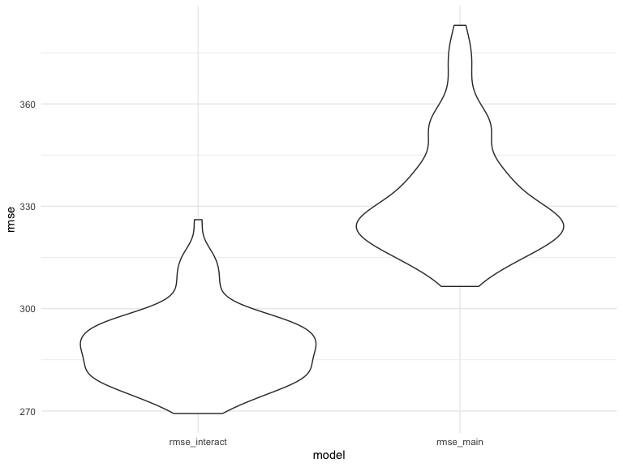

HW6
================
Xing Chen

## Problem 1

### Load and clean

import the dataset

``` r
child_bw_data = read_csv(file = "./data/birthweight.csv")
```

    ## Parsed with column specification:
    ## cols(
    ##   .default = col_double()
    ## )

    ## See spec(...) for full column specifications.

change numeric variables with categorical values to factor variables

``` r
child_bw_data = 
child_bw_data %>% 
  mutate(
    babysex = as.factor(babysex),
    babysex = recode(babysex, "1" = "male", "2" = "female"),
    malform = as.factor(malform), 
    malform = recode(malform, "0" = "absent", "1" = "present"), 
    frace = as.factor(frace), 
    frace = recode(frace, "1" = "White", "2"  = "Black", "3" = "Asian", "4" = "Puerto Rican", 
                  "8" = "Other", "9" = "Unkown"), 
    mrace = as.factor(mrace), 
    mrace = recode(frace, "1" = "White", "2"  = "Black", "3" = "Asian", "4" = "Puerto Rican", 
                  "8" = "Other")
 )

child_bw_data %>% 
  select(babysex, malform, frace, mrace) %>% 
  map(~levels(.x))
```

    ## $babysex
    ## [1] "male"   "female"
    ## 
    ## $malform
    ## [1] "absent"  "present"
    ## 
    ## $frace
    ## [1] "White"        "Black"        "Asian"        "Puerto Rican"
    ## [5] "Other"       
    ## 
    ## $mrace
    ## [1] "White"        "Black"        "Asian"        "Puerto Rican"
    ## [5] "Other"

create my own regression model for birthweight

create a regression model, using length at birth and gestational age as
main predictors

``` r
main_eff_model = 
  child_bw_data %>% 
  lm(bwt ~ blength + gaweeks, data = .)
main_eff_model %>% 
  broom::tidy()
```

    ## # A tibble: 3 x 5
    ##   term        estimate std.error statistic  p.value
    ##   <chr>          <dbl>     <dbl>     <dbl>    <dbl>
    ## 1 (Intercept)  -4348.      98.0      -44.4 0.      
    ## 2 blength        129.       1.99      64.6 0.      
    ## 3 gaweeks         27.0      1.72      15.7 2.36e-54

``` r
# this chunk of code should appear above
child_bw_data %>% 
  modelr::add_residuals(main_eff_model) %>% 
  modelr::add_predictions(main_eff_model) %>%
  ggplot(aes(x = resid, y = pred)) + geom_point()
```


create a regression model, using head circumference, length, sex, and
all interactions as main predictors

``` r
interact_model = 
  child_bw_data %>% 
  lm(bwt ~ bhead + blength + babysex + bhead * blength + 
     bhead * babysex + blength * babysex, data = .) %>% 
  broom::tidy()
```

### Comparison

``` r
cv_df = 
  crossv_mc(child_bw_data, 100) %>% 
  mutate(
    train = map(train, as_tibble),
    test = map(test, as_tibble)
  )

cv_df = 
  cv_df %>% 
  mutate(
    main_mod = map(train, ~lm(bwt ~ blength + gaweeks, data = .x)),
    interact_mod = map(train, ~lm(bwt ~ bhead + blength + babysex + bhead * blength + 
     bhead * babysex + blength * babysex, data = .x))
  ) %>% 
  mutate(
    rmse_main = map2_dbl(main_mod, test, ~rmse(model = .x, data = .y)),
    rmse_interact = map2_dbl(interact_mod, test, ~rmse(model = .x, data = .y))
  )

cv_df %>% 
  select(rmse_main, rmse_interact) %>% 
  pivot_longer(
    everything(),
    names_to = "model",
    values_to = "rmse"
  ) %>% 
  ggplot(aes(x = model, y = rmse)) + geom_violin()
```


