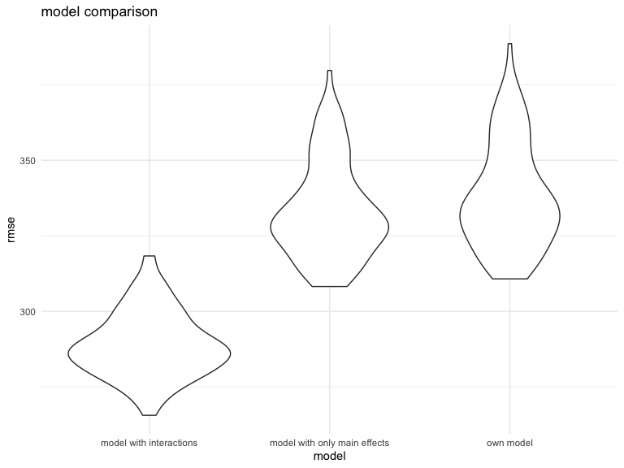

HW6
================
Xing Chen

## Problem 1

### Load and clean

**import the dataset**

``` r
child_bw_data = read_csv(file = "./data/birthweight.csv")
```

    ## Parsed with column specification:
    ## cols(
    ##   .default = col_double()
    ## )

    ## See spec(...) for full column specifications.

**change numeric variables with categorical values to factor variables**

``` r
child_bw_data = 
child_bw_data %>% 
  mutate(
    babysex = as.factor(babysex),
    babysex = recode(babysex, "1" = "male", "2" = "female"),
    malform = as.factor(malform), 
    malform = recode(malform, "0" = "absent", "1" = "present"), 
    frace = as.factor(frace), 
    frace = recode(frace, "1" = "White", "2"  = "Black", "3" = "Asian", "4" = "Puerto Rican", 
                  "8" = "Other", "9" = "Unkown"), 
    mrace = as.factor(mrace), 
    mrace = recode(frace, "1" = "White", "2"  = "Black", "3" = "Asian", "4" = "Puerto Rican", 
                  "8" = "Other")
 )

child_bw_data %>% 
  select(babysex, malform, frace, mrace) %>% 
  map(~levels(.x))
```

    ## $babysex
    ## [1] "male"   "female"
    ## 
    ## $malform
    ## [1] "absent"  "present"
    ## 
    ## $frace
    ## [1] "White"        "Black"        "Asian"        "Puerto Rican"
    ## [5] "Other"       
    ## 
    ## $mrace
    ## [1] "White"        "Black"        "Asian"        "Puerto Rican"
    ## [5] "Other"

### Build models

**create my own regression model for birthweight**

``` r
own_model = 
  child_bw_data %>% 
  lm(bwt ~ babysex + blength + fincome + malform + momage + smoken, data = .)
own_model %>% 
  broom::tidy()
```

    ## # A tibble: 7 x 5
    ##   term           estimate std.error statistic   p.value
    ##   <chr>             <dbl>     <dbl>     <dbl>     <dbl>
    ## 1 (Intercept)    -3911.      97.5     -40.1   1.54e-299
    ## 2 babysexfemale     -7.07    10.3      -0.685 4.93e-  1
    ## 3 blength          137.       1.91     71.9   0.       
    ## 4 fincome            1.63     0.209     7.81  6.92e- 15
    ## 5 malformpresent    76.0     87.4       0.869 3.85e-  1
    ## 6 momage             7.00     1.40      4.99  6.13e-  7
    ## 7 smoken            -2.68     0.698    -3.83  1.28e-  4

**Description of modelling process**

baby’s sex and length have a direct influence on infant birthweight.
Thus, I include these 2 variables in the model. Furthermore, mother’s
age, mother’s smoking status, and presence of malformation have a direct
influence on infant’s birthweight. Thus, these variables are also
included in the model. A pregnant woman in a family with higher income
would generally go to see a doctor more often and reveive a better
services. A pregnant woman in a family with higher income is more likely
to have a healthier baby. Thus, `fincome` is also included in the model.

**make a plot of model residuals against fitted values**

``` r
child_bw_data %>% 
  modelr::add_residuals(own_model) %>% 
  modelr::add_predictions(own_model) %>%
  ggplot(aes(x = resid, y = pred)) + geom_point()
```


### Make Comparisons

``` r
cv_df = 
  crossv_mc(child_bw_data, 100) %>% 
  mutate(
    train = map(train, as_tibble),
    test = map(test, as_tibble)
  )

cv_df = 
  cv_df %>% 
  mutate(
    own_mod = map(train, ~lm(bwt ~ babysex + blength + fincome + malform + momage + 
                                   smoken, data = .)),
    main_mod = map(train, ~lm(bwt ~ blength + gaweeks, data = .x)),
    interact_mod = map(train, ~lm(bwt ~ bhead + blength + babysex + bhead * blength + 
     bhead * babysex + blength * babysex, data = .x))
  ) %>% 
  mutate(
    rmse_own = map2_dbl(own_mod, test, ~rmse(model = .x, data = .y)), 
    rmse_main = map2_dbl(main_mod, test, ~rmse(model = .x, data = .y)),
    rmse_interact = map2_dbl(interact_mod, test, ~rmse(model = .x, data = .y))
  )

cv_df %>% 
  select(starts_with("rmse")) %>% 
  pivot_longer(
    everything(),
    names_to = "model",
    values_to = "rmse"
  ) %>% 
  ggplot(aes(x = model, y = rmse)) + geom_violin()
```


